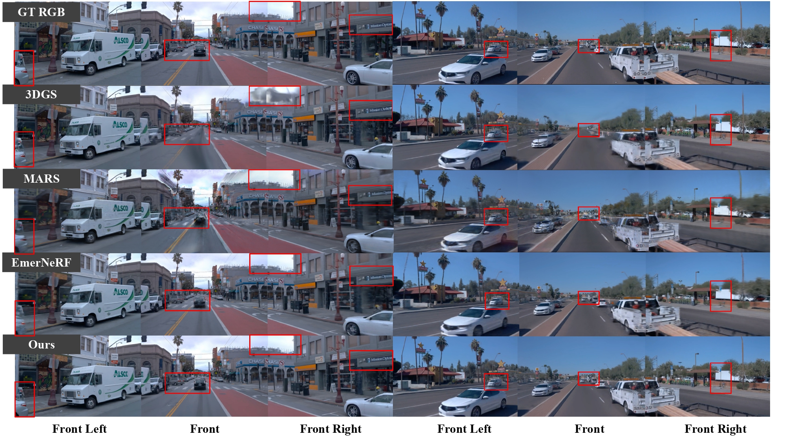
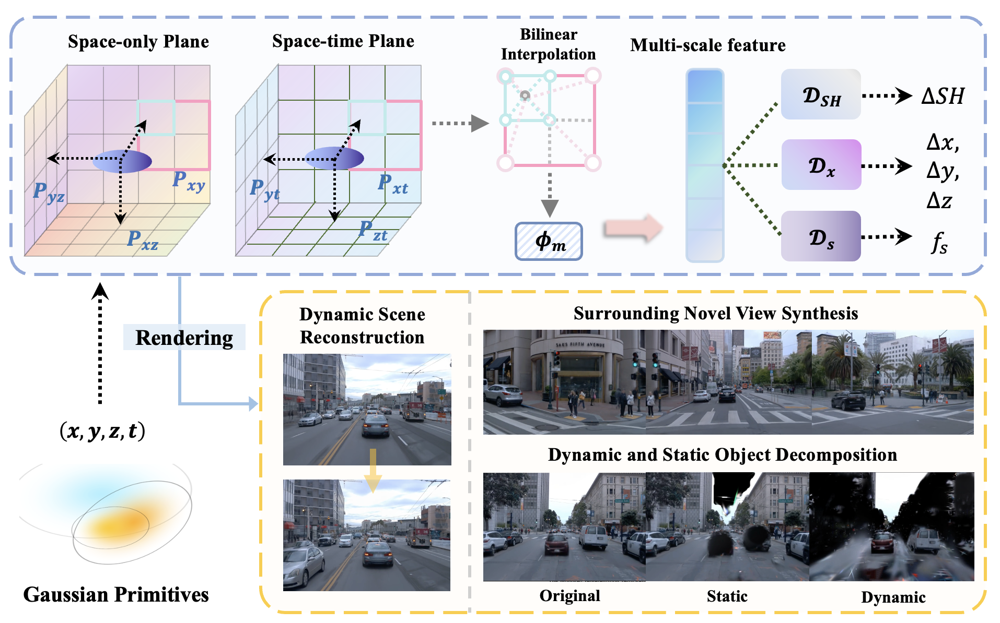

# $\textit{S}^3$Gaussian: Self-Supervised Street Gaussians for Autonomous Driving
### [Paper]()  | [Project Page]() 

<!-- > SelfOcc: Self-Supervised Vision-Based 3D Occupancy Prediction, CVPR 2024 -->

> [Nan Huang](https://github.com/nnanhuang)\*, 
[Xiaobao Wei](https://ucwxb.github.io/), [Wenzhao Zheng](https://wzzheng.net/) $\dagger$, Pengju An, [Ming Lu](https://lu-m13.github.io/), [Wei Zhan](https://zhanwei.site/),[Masayoshi Tomizuka](https://me.berkeley.edu/people/masayoshi-tomizuka/),
[Kurt Keutzer](https://people.eecs.berkeley.edu/~keutzer/),[Shanghang Zhang](https://www.shanghangzhang.com/)$\ddagger$

\* Work done while interning at UC Berkeley $\dagger$ Project leader $\ddagger$ Corresponding author

<p align="center">
  
</p>

## News
- **[2023/5/30]** Training code release.
- **[2023/5/30]** Evaluation code release.
- **[2024/5/30]** Paper released on [arXiv](https://arxiv.org/abs/2311.12754).
- **[2024/5/30]** Demo release.

## Demo

### Trained results compared to baseline:


<!-- ### More demo videos can be downloaded [here](https://cloud.tsinghua.edu.cn/d/640283b528f7436193a4/). -->

## Overview


- To tackle the challenges in self-supervised street scene decomposition, our method consists of a Multi-resolution Hexplane Structure Encoder to encode 4D grid into feature planes and a multi-head Gaussian Decoder to decode them into deformed 4D Gaussians. The entire pipeline is optimized without extra annotations in a self-supervised manner, leading to superior scene decomposition ability and rendering quality.

## Getting Started

### Environmental Setups
Our code is developed on Ubuntu 22.04 using Python 3.9 and pytorch=1.13.1+cu116. We also tested on pytorch=2.2.1+cu118. We recommend using conda for the installation of dependencies.

```bash
git clone https://github.com/nnanhuang/S3Gaussian.git --recursive
cd S3Gaussian
conda create -n S3Gaussian python=3.9 
conda activate S3Gaussian

pip install -r requirements.txt
pip install -e submodules/depth-diff-gaussian-rasterization
pip install -e submodules/simple-knn
```


### Preparing Dataset

Follow detailed instructions in [Prepare Dataset](docs/prepare_data.md).


### Training

For training first clip (eg. 0-50 frames), run 

```
python train.py -s $data_dir --port 6017 --expname "waymo" --model_path $model_path 
```
If you want to try novel view  synthesis, use 
```
--configs "arguments/nvs.py"
```

For training next clip (eg. 51-100 frames), run 
```
python train.py -s $data_dir --port 6017 --expname "waymo" --model_path $model_path 
--prior_checkpoint "$prior_dir/chkpnt_fine_50000.pth"
```
Also, you can load an existing checkpoint with:

```python
python train.py -s $data_dir --port 6017 --expname "waymo" --start_checkpoint "$ckpt_dir/chkpnt_fine_30000.pth"
```
For more scripts examples, please check [here](scripts).
### Evaluation and Visualization

You can visualize and eval a checkpoints follow:
```python
python train.py -s $data_dir --port 6017 --expname "waymo" --start_checkpoint "$ckpt_dir/chkpnt_fine_50000.pth"
--eval_only
```
Then you can get rendering RGB videos, ground truth RGB videos, depth videos, dynamic rgb videos and static rgb videos.
## Related Projects

Our code is based on [4D Gaussian Splatting for Real-Time Dynamic Scene Rendering](https://github.com/hustvl/4DGaussians/tree/master) and [EmerNeRF](https://github.com/NVlabs/EmerNeRF?tab=readme-ov-file). 

Thanks to these excellent open-sourced repos!


## Citation

If you find this project helpful, please consider citing the following paper:
```
@article{
}
```
